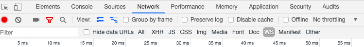

# JSSIP Webrtc React Frmework Client 

Webrtc 
SIP over Websoket
Communicates to Kamailio SIP websocket Server 
React framework (jsx)

## Install dependencies:

get all node modules

```bash
$ npm install
```
* Globally install the NPM `gulp-cli` package:
```bash
$ npm install -g gulp-cli
```

##  Change settings inside index.html
```
window.SETTINGS =
{
	display_name        : null,
	uri                 : null,
	password            : null,
	socket              :
	{
		uri           : 'wss://<kamailio_ip>:443', //'wss://tryit.jssip.net',
		via_transport : 'auto',
	},
	registrar_server    : null,
	contact_uri         : null,
	authorization_user  : null,
	instance_id         : null,
	session_timers      : true,
	use_preloaded_route : false,
	pcConfig            :
	{
		rtcpMuxPolicy : 'negotiate',
		iceServers    :
		[
			{ urls : [ 'stun:stun.l.google.com:19302' ] }
		]
	},
	callstats           :
	{
		enabled   : false,
		AppID     : null,
		AppSecret : null
	}
};
```
## Run Gulp develop

```bash
gulp develop
```
Once built, the `out/` directory is created with all the HTML, CSS and JavaScript files to be deployed in your own server.
Note : Everything inside out fodler is autogenerated from gulp , do not change that dircetly 

All gulp scripts included 
  * `gulp prod`  - production/minified mode.
  * `gulp dev` - development mode.
  * `gulp live` - development mode, opens the local website and watches for changes in the source code.

## Browser 

https://localhost:3000/

## Monitor 

chrome Developer tools -> Network -> WS



## tryit-jssip

The [JsSIP](http://jssip.net) demo application. Check it online at https://tryit.jssip.net

## Hardcoded settings

The app allows entering settings via an HTTP form in the Login section. However, the developer can hardcode some specific settings (for example the _callstats.io_  settings) by defining a `window.SETTINGS` variable before the `tryit-jssip.js` is loaded.

Check the commented code in the [index.html](./index.html) and fill it as needed.


## Author

Iñaki Baz Castillo ([@ibc](https://github.com/ibc/) at Github)


## License

[MIT](./LICENSE)
